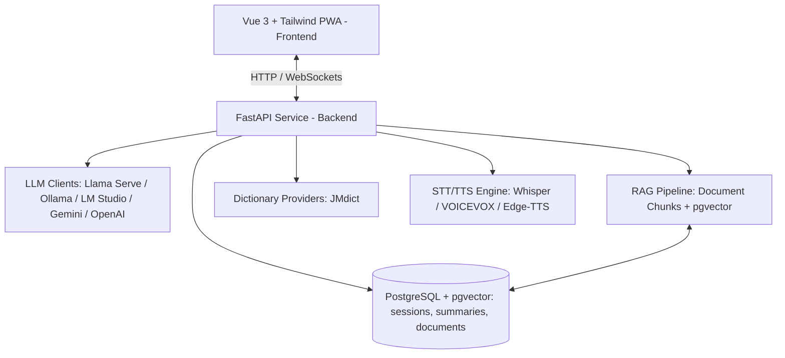

# KotoSensei (琴先生) — Voiced Japanese Language Studio & PWA

> [!NOTE]
> **Personal Learning Project**: KotoSensei is created strictly for **personal use** and tailored to support my own **personal way of learning** Japanese and building local AI applications. Features, workflows, and tools in this repository are designed around my specific study preferences and technical experimentation.

**KotoSensei** is a local-first, AI-powered voiced Japanese language teacher and study studio. It features interactive conversation, real-time dictionary lookups (JMdict), RAG document referencing, structured session summaries, and support for local (Llama Serve, Ollama, LM Studio) and frontier LLMs.

---

## 🎯 Purpose & Personal Learning Focus

This project serves as a personal sandbox designed to combine audio/speech processing, local LLM orchestration, and Japanese language acquisition into a single unified workflow:
* **Custom Learning Workflow:** Tailored specifically for interactive Japanese speech practice, vocabulary lookup, and personal study document retrieval.
* **Hands-on AI Exploration:** Built to experiment with local-first architectures (`pgvector`, `faster-whisper`, VOICEVOX/Edge-TTS, FastAPI, Vue 3 PWA).
* **Non-Commercial Scope:** Maintained strictly for personal education and individual self-study.

---

## 🏗️ System Architecture



* **Frontend:** Vue 3 (Composition API), Vite, Tailwind CSS, Pinia, Lucide Icons, Web App Manifest (`manifest.webmanifest`).
* **Backend:** Python 3.12, FastAPI, SQLAlchemy, Alembic, `pgvector`, `faster-whisper`, VOICEVOX / Edge-TTS.
* **Database:** PostgreSQL + `pgvector` extension running locally via Docker.
* **Deployment:** 100% local, single-command Docker setup (`docker compose up -d`).

---

## ⚡ Quick Start with Docker

### Prerequisites
- Docker & Docker Compose installed
- (Optional) Local LLM server running on port `8080` or `11434` (e.g. `llama serve`)

### 1. Launch Services
```bash
git clone https://github.com/yourname/language-sensei.git
cd language-sensei

# Start PostgreSQL, FastAPI Backend, and Vue Frontend
docker compose up -d
```

### 2. Access Applications
* **Frontend Web App & PWA:** [http://localhost:5173](http://localhost:5173)
* **Backend API Documentation:** [http://localhost:8080/docs](http://localhost:8080/docs) (or `http://localhost:8000/docs`)
* **PostgreSQL Database:** `localhost:5432`

---

## 🧪 Running Automated Tests

```bash
# Run backend tests (pytest)
docker compose exec backend pytest

# Run frontend tests (vitest)
docker compose exec frontend npm test
```

---

## 📄 License & Personal Usage Disclaimer

MIT License. Open source for Japanese language learners and developers.

> **Disclaimer:** This repository is maintained primarily for personal learning and self-directed study.