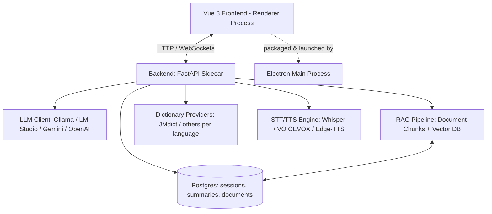

# Implementation Plan - Personal Voiced Language Teacher

We will build a personal voiced language teacher application named **KotoSensei** (琴先生). It's a desktop app (Windows first, then macOS/Linux) built with **Electron**, featuring voiced/text interaction with interruptible speech, supports Japanese learning (extensible to other languages), integrates with local/online LLMs (Ollama, LM Studio, Gemini, OpenAI), keeps session summaries of what you've learned, and features a RAG pipeline for document + dictionary referencing.

## Proposed System Architecture



**Deployment model:** everything runs locally on the user's machine. No hosting costs beyond optional pay-per-token frontier API usage (Gemini/OpenAI) if chosen instead of local Ollama/LM Studio. Postgres, the vector store, and dictionaries all run on-device.

---
# AGENTS.md — KotoSensei (琴先生) Development Protocol

## 1. Project Context & Goals
KotoSensei is a local, voiced Japanese language teacher desktop app.
- **Architecture**: Electron desktop shell + FastAPI Python sidecar + Vue 3 frontend + PostgreSQL (`pgvector`).
- **Core Features**: Local LLM orchestration, RAG document search, JMdict dictionary lookups, structured session summaries, and low-latency audio/speech streaming.

---

## 2. Tech Stack & Directory Standards
Maintain strict separation across the codebase layers:

- **Backend (`/backend`)**:
  - Python 3.14, FastAPI, SQLAlchemy (async/sync), Alembic, `pgvector`, `psycopg2-binary`.
  - All database models MUST live in `backend/app/models.py`.
  - External language dictionaries live in `backend/app/dictionaries/`.
  - API endpoints MUST be defined inside modular router files under `backend/app/routers/` (e.g., `routers/chat.py`, `routers/rag.py`).
  - `backend/app/main.py` MUST NOT declare route logic directly; it should only import and register routers via `app.include_router()`.

- **Frontend (`/frontend`)**:
  - Vue 3 using **Composition API with `<script setup>` syntax only**.
  - Vite, Tailwind CSS, Pinia (state management).
  - **Centralized API Client**: All frontend API calls MUST use a centralized client module in `frontend/src/services/api.js`. Never write raw `fetch()` or `axios` calls directly inside `.vue` components.

- **Desktop Shell (`/electron`)**:
  - Electron main process (`electron/main.js`) handles window creation and spawns the FastAPI sidecar binary.

---

## 3. Strict Execution Guardrails

1. **Task Scope Lock**:
   - Execute **ONLY** the single task specified by the user from `TASK.md`. 
   - Never write boilerplate for future milestones ahead of schedule.

2. **Test-Driven First (TDD)**:
   - Every feature must have a corresponding test.
   - Run `pytest` inside `/backend` for backend changes.
   - Run `npm test` inside `/frontend` for UI component changes.
   - Never mark a task as complete in `TASK.md` if tests are failing.

3. **Database & Migrations**:
   - Postgres runs locally via `docker-compose.yml` on port `5432`.
   - Always use the `pgvector/pgvector:pg16` image or equivalent extension-enabled PostgreSQL setup.
   - Use environment variables for DB parameters; do not hardcode passwords in `.py` files.

4. **Error Recovery & Terminal Loop**:
   - If a test fails after running commands, inspect `stdout` and `stderr` logs, correct the implementation, and re-run the suite automatically.
   - Do not request human intervention for minor syntax or import errors—fix them inside the loop.

---
## Proposed Components

### 0. Desktop Shell — Electron

- Frontend: **Vue 3** (matches existing experience — no framework switch needed), rendered inside Electron's renderer process.
- Electron bundles Chromium + Node, so the installer (~150MB+) and idle memory footprint are heavier than a native-webview alternative like Tauri — worth knowing as a tradeoff, but it's a mature, very well-documented path with the biggest ecosystem for this kind of app (auto-update, native menus, tray icons, etc. are all first-class).
- The Python/FastAPI backend runs as a **sidecar process**: packaged into a standalone binary with `pyinstaller`, then spawned and managed from Electron's **main process** (via Node's `child_process`) alongside the renderer. The main process handles starting the backend on app launch and killing it cleanly on quit.
- Priority: Windows build first via `electron-builder` (NSIS installer); macOS/Linux builds later are packaging-target additions (`electron-builder` supports all three from the same config), not a rearchitecture.

### 1. Backend (`/backend`)
A lightweight, fast Python backend using **FastAPI** to orchestrate:

- **LLM Integrations**: unified LLM client interface supporting:
  - Ollama & LM Studio (local OpenAI-compatible endpoints)
  - Frontier APIs (Gemini, OpenAI)
- **RAG Pipeline** (language-agnostic, unchanged core):
  - Document ingestion (TXT, PDF, MD, JSON).
  - Text splitting and embedding generation (local HuggingFace embeddings or online embeddings).
  - Vector storage via `ChromaDB` or similar lightweight index.
- **Dictionary Lookup** (separate from general RAG — exact-match lookups, not embedding search):
  - Pluggable `DictionaryProvider` interface: `lookup(term) -> Entry`.
  - `jmdict.py` implements this for Japanese using the free JMdict dataset (one-time local ingest, no recurring cost).
  - New languages plug in by adding a provider behind the same interface — RAG code doesn't change.
- **Session Summaries** (replacing SRS for now):
  - After each session, the LLM produces a structured summary: topics covered, new vocab/grammar introduced, mistakes made, in JSON — not just a raw transcript dump.
  - Summaries are stored per-session in Postgres, so future sessions (and you, reviewing manually) can reference "what did we cover last time."
- **Voice Pipeline**:
  - **STT**: local Whisper (`faster-whisper`) via the backend rather than the browser's Web Speech API — more reliable for Japanese, works offline, consistent across platforms (important since Tauri's webview isn't always Chromium).
  - **TTS**: VOICEVOX for natural Japanese voices; Edge-TTS as a fallback/other-language option.
  - **Barge-in / interruption**:
    - V1 (ship first): push-to-talk / hotkey — pressing it immediately cancels in-flight TTS playback and the LLM stream via a websocket `cancel` message.
    - V2 (later upgrade): VAD-based natural interruption (e.g. Silero VAD) on the mic stream, most reliable with headphones since it avoids speaker-into-mic leakage.
    - The websocket protocol includes the `cancel` message from day one so V2 is a drop-in upgrade, not a rearchitecture.

### 2. Database — PostgreSQL
Runs locally (e.g. via Docker), no hosting cost. Stores:
- `documents` / `chunks` — ingested RAG source material + embeddings references.
- `sessions` — conversation turns.
- `session_summaries` — structured per-session summary (topics, new vocab, mistakes).
- `dictionary_entries` — ingested JMdict (or future language) data.

### 3. Frontend (`/frontend`)
Vue 3 app running inside the Tauri shell, featuring:
- **Voice Interface**:
  - Voice wave visualizer showing microphone activity.
  - One-click microphone toggle, plus push-to-talk interrupt hotkey.
  - Automatic playback of the teacher's responses via TTS, with instant cancel on interrupt.
- **Session Summary View**:
  - Browse past sessions and their structured summaries (topics, new vocab, mistakes).
- **RAG Dashboard**:
  - Document upload interface (drag-and-drop file ingestion).
  - List of loaded reference materials.
  - Dictionary status (e.g. "JMdict loaded — 190k entries").
- **Settings Panel**:
  - Select LLM Provider (Gemini, OpenAI, Ollama, LM Studio) and enter custom base URLs/API keys.
  - Select active language (default Japanese) — determines which dictionary provider is queried.
  - Adjust teaching style and speech options.
- **Rich Aesthetics**:
  - Modern Glassmorphism/Dark mode theme with smooth animations, custom fonts, conversational layout.

---

## Proposed Directory Structure

```
voiced-teacher/
├── electron/                      # Electron shell
│   ├── main.js                    # Main process: window creation, backend sidecar lifecycle
│   ├── preload.js                 # Context-isolated bridge to renderer
│   └── binaries/                  # pyinstaller-packaged FastAPI backend
├── backend/
│   ├── app/
│   │   ├── __init__.py
│   │   ├── main.py               # FastAPI application entrypoint
│   │   ├── config.py             # Settings and API keys configuration
│   │   ├── llm.py                # Unified LLM provider class
│   │   ├── rag.py                # Document ingestion & vector search
│   │   ├── summaries.py          # Session summary generation
│   │   ├── models.py             # Postgres models: Session, SessionSummary, Document
│   │   ├── tts_stt.py            # Whisper STT, VOICEVOX/Edge-TTS, barge-in handling
│   │   └── dictionaries/
│   │       ├── base.py           # DictionaryProvider interface
│   │       ├── registry.py       # active language -> provider
│   │       └── jmdict.py         # Japanese (JMdict)
│   ├── requirements.txt
│   └── data/                     # Vector store and raw documents storage
├── frontend/
│   ├── src/
│   │   ├── components/           # VoiceVisualizer, ChatArea, SessionSummaries, DocumentManager, Settings
│   │   ├── App.vue
│   │   ├── index.css              # Premium design tokens & animations
│   │   └── main.js
│   ├── tests/
│   │   ├── components/            # Vitest + @vue/test-utils component tests
│   │   ├── websocket.test.js       # cancel/token/summary event handling
│   │   └── setup.js                # jsdom + audio API mocks
│   ├── vite.config.js               # includes Vitest config (test: {...})
│   ├── package.json
│   └── index.html
└── docker-compose.yml             # Postgres (+ optional Ollama, Chroma) for local dev
```

---

## Verification Plan

### Automated Tests
- **Frontend (Vitest)**:
  - Component tests for `VoiceVisualizer`, `ChatArea`, `SessionSummaries`, `DocumentManager`, `Settings` using `@vue/test-utils` — Vitest shares Vite's config/transforms, so `.vue` SFCs work out of the box with no extra transform setup (unlike Jest).
  - Websocket message handling: mock the socket and verify UI state transitions correctly on `token`, `cancel`, and `summary` events.
  - Barge-in behavior: simulate a `cancel` event mid-playback and assert audio playback stops and UI returns to listening state.
  - Settings/provider switching logic (LLM provider, active language) tested in isolation from the actual network calls.
- **Backend (pytest)** for verifying:
  - RAG document chunking and search.
  - Dictionary provider lookups (JMdict exact-match correctness).
  - LLM integration API wrappers.
  - Session summary generation produces valid structured output.

### Manual Verification
- Launch the Electron app in dev mode (`electron .` / `npm run dev`), which spawns the FastAPI sidecar from the main process and loads the Vue frontend in the renderer.
- Test uploading a Japanese dictionary/text document, query it, and verify the RAG pipeline retrieves references successfully.
- Test JMdict lookups return correct readings/definitions for exact terms.
- Test voicing inputs and verifying text-to-speech (VOICEVOX) outputs in Japanese.
- Test interrupting TTS playback mid-response via push-to-talk and confirm playback/LLM stream stops immediately.
- Test switching between local Ollama and online frontier models.
- Complete a session, then verify a structured summary (topics/vocab/mistakes) appears in the Session Summary view.
- Package a Windows build via `electron-builder` and verify it launches without a separately-running dev backend, and that the sidecar process is killed cleanly on app quit.

## Costs Summary
- **Hosting**: $0 — everything (Postgres, vector DB, dictionaries, RAG) runs locally.
- **Recurring cost**: only if using frontier LLM APIs (Gemini/OpenAI) instead of local models — pay-per-token, optional.
- **Admin portal**: not needed — this is single-user. Dictionaries are ingested once via a CLI script (`python -m app.ingest_dictionary jmdict.xml`); the in-app RAG Dashboard covers user-facing document management.