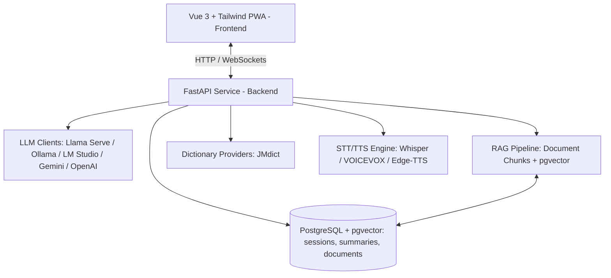

# KotoSensei (琴先生) — Voiced Japanese Language Studio & PWA

**KotoSensei** is a local-first, AI-powered voiced Japanese language teacher and study studio. It features interactive conversation, real-time dictionary lookups (JMdict), RAG document referencing, structured session summaries, and support for local (Llama Serve, Ollama, LM Studio) and frontier LLMs (Gemini, OpenAI).

---

## 🏗️ System Architecture



* **Frontend:** Vue 3 (Composition API), Vite, Tailwind CSS, Pinia, Lucide Icons, Web App Manifest (`manifest.webmanifest`).
* **Backend:** Python 3.12, FastAPI, SQLAlchemy, Alembic, `pgvector`, `faster-whisper`, VOICEVOX / Edge-TTS.
* **Database:** PostgreSQL + `pgvector` extension running locally via Docker.
* **Deployment:** 100% local, single-command Docker setup (`docker compose up -d`).

---

## ⚡ Quick Start with Docker

### Prerequisites
- Docker & Docker Compose installed
- (Optional) Local LLM server running on port `8080` or `11434` (e.g. `llama serve`)

### 1. Launch Services
```bash
git clone https://github.com/yourname/language-sensei.git
cd language-sensei

# Copy environment template if needed
cp .env.example .env 2>/dev/null || true

# Start PostgreSQL, FastAPI Backend, and Vue Frontend
docker compose up -d
```

### 2. Access Applications
* **Frontend Web App & PWA:** [http://localhost:5173](http://localhost:5173)
* **Backend API Documentation:** [http://localhost:8080/docs](http://localhost:8080/docs) (or `http://localhost:8000/docs`)
* **PostgreSQL Database:** `localhost:5432`

---

## 📱 Installing as a Desktop or Mobile App (PWA)

KotoSensei includes a **Web App Manifest** for standalone app execution without heavy Electron overhead:

1. Open [http://localhost:5173](http://localhost:5173) in Chrome, Brave, or Edge.
2. Click **Install KotoSensei** in the address bar (or Menu $\rightarrow$ *Save and Share* $\rightarrow$ *Install KotoSensei*).
3. The app will launch in its own borderless desktop window with a taskbar icon!

---

## 🧪 Running Automated Tests

```bash
# Run backend tests (pytest)
docker compose exec backend pytest

# Run frontend tests (vitest)
docker compose exec frontend npm test
```

---

## 📄 License
MIT License. Open source for Japanese language learners and developers.